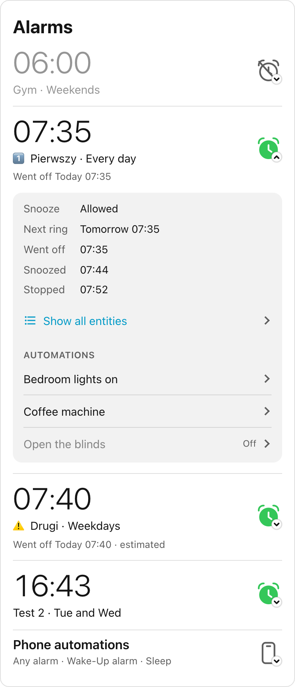

<p align="center">
  
</p>

<h1 align="center">iPhone Alarms Sync</h1>

<p align="center"><strong>Your iPhone alarm. Now a Home Assistant trigger.</strong></p>

<p align="center">
  <a href="https://github.com/Jozwiaczek/iphone-alarms-sync/releases/latest"></a>
</p>

<p align="center">
  <a href="https://my.home-assistant.io/redirect/hacs_repository/?owner=Jozwiaczek&repository=iphone-alarms-sync&category=integration"></a>
</p>

Wake up to a warm bedroom. Lights on when the alarm rings.

iOS shares alarms with no app. Only with Shortcuts. One shortcut sends them to Home Assistant. It runs each time you close the Clock app.

Works on iPhone, iPad and Mac.

## ✨ What you get

**With one shortcut**

- **Native and exact.** Built on Apple's own Shortcuts automations. No polling. No workarounds.
- **Every alarm is a device.** Time, label, repeat days.
- **Its settings too.** On or off. Snooze allowed or not.
- **Next and last.** Next alarm, next ring, last ring. Act before you wake up.
- **Alarm goes off trigger.** Fires at the alarm's time ([estimated](docs/shortcuts.md#estimated-goes-off)). Pick one alarm or many.
- **Every phone at home.** Add each one. Each gets its own alarms.
- **Any iPhone language.** Repeat days are read in every one.
- **Home Assistant in your language.** Setup, entities, triggers and the dashboard card come in 🇬🇧 English and 🇵🇱 Polish. Missing yours? [Add it](CONTRIBUTING.md#adding-a-language): one JSON file and a short list of card texts.

**Private.** The shortcut templates hold no personal data. [Read their source](shortcuts/).

**With the event shortcuts** (optional)

- **Goes off. Snoozed. Stopped.** The exact moment. Per alarm or for any alarm.
- **Apple's Sleep schedule.** Wind Down begins. Bedtime begins. Waking up. The Wake-Up alarm.
- **Event history.** When each alarm last went off, was snoozed or stopped.
- **Missed-event alert.** A sensor turns on when an alarm rang but its *Goes off* event never came.

Add the event shortcuts any time: [Shortcuts Setup Guide](docs/shortcuts.md).

**On your dashboard**

- **A ready card.** Your alarms, the way the Clock app shows them. Nothing extra to install.
- **What your alarms run.** Tap an alarm to see when it last rang. Tap **Automations** to see every automation that uses the phone and its alarms.

<p align="center">
  <picture>
    <source media="(prefers-color-scheme: dark)" srcset="assets/card-dark.png">
    
  </picture>
</p>

Setup and options: [Dashboard card](docs/dashboard-card.md).

### Good to know

- Sync is one-way: Home Assistant can't change alarms on the phone.
- iOS lets no app read alarms in the background. Home Assistant learns about changes only when a shortcut runs, so an alarm changed with Siri or on an Apple Watch updates after you next close the Clock app.
- iOS turns a one-time alarm off after it rings; Home Assistant shows it until the next sync.
- Next Alarm and Next Occurrence are calculated in Home Assistant's time zone.

## 🚀 Installation

**Requirements:** Home Assistant 2026.8 or newer, an iPhone or iPad with iOS 17+ or a Mac with Shortcuts automations, and the Home Assistant app 2026.9.3 or newer.

### Step 1: Install from the Marketplace

1. Click **Open in the Marketplace** above, or go to Settings → Marketplace and search for "iPhone Alarms Sync"
2. Download "iPhone Alarms Sync"
3. Restart Home Assistant

On Home Assistant 2026.8–2026.10 the button opens HACS instead.

### Step 2: Add your phone

1. Settings → Devices & Services → Add Integration → "iPhone Alarms Sync"
2. Pick your Home Assistant app device or enter a name
3. Follow the screen: it shows your **Phone ID**, the QR code of the Sync shortcut and the iOS automation to create

Alarms then sync every time you close the Clock app.

For the event shortcuts, open **Configure → Event Shortcuts Setup**. The [Shortcuts Setup Guide](docs/shortcuts.md) has every link and step.

## 🎯 Examples

Warm the bedroom 30 minutes before the next alarm:

```yaml
triggers:
  - trigger: time
    at:
      entity_id: sensor.johns_iphone_next_alarm
      offset: "-00:30:00"
actions:
  - action: climate.set_temperature
    target:
      entity_id: climate.bedroom
    data:
      temperature: 21
```

Turn on the light when an alarm goes off. In the automation editor, pick the trigger **Alarm goes off** and your alarms. In YAML:

```yaml
triggers:
  - trigger: iphone_alarms_sync.goes_off
    target:
      entity_id: event.johns_iphone_wake_alarm
actions:
  - action: light.turn_on
    target:
      entity_id: light.bedroom
```

Both work with the Sync shortcut alone. An event shortcut makes *goes off* exact.

## 🔧 Troubleshooting

Most problems come from the shortcut: see the [Troubleshooting guide](docs/shortcuts.md#troubleshooting).

Reporting a bug? Attach the diagnostics: Settings → Devices & services → iPhone Alarms Sync → ⋮ → Download diagnostics.

Still stuck? Ask in [Q&A](https://github.com/Jozwiaczek/iphone-alarms-sync/discussions/categories/q-a).

## 📚 More

- [Shortcuts Setup Guide](docs/shortcuts.md): every shortcut, step by step
- [Reference](docs/reference.md): entities, triggers, event data, options, removal
- [Beta versions](docs/reference.md#beta-versions)
- [Issues](https://github.com/Jozwiaczek/iphone-alarms-sync/issues)

## 🤝 Contributing

Bug reports, ideas and pull requests are welcome. [CONTRIBUTING.md](CONTRIBUTING.md) shows where to ask a question, report a bug or suggest an idea, and how to send a pull request.

Speak a language other than English or Polish? A translation is a good first pull request: [Adding a language](CONTRIBUTING.md#adding-a-language).

## ☕ Support

If you find this integration useful, consider supporting its development:

[](https://github.com/sponsors/Jozwiaczek) [](https://buymeacoffee.com/jozwiaczek)
